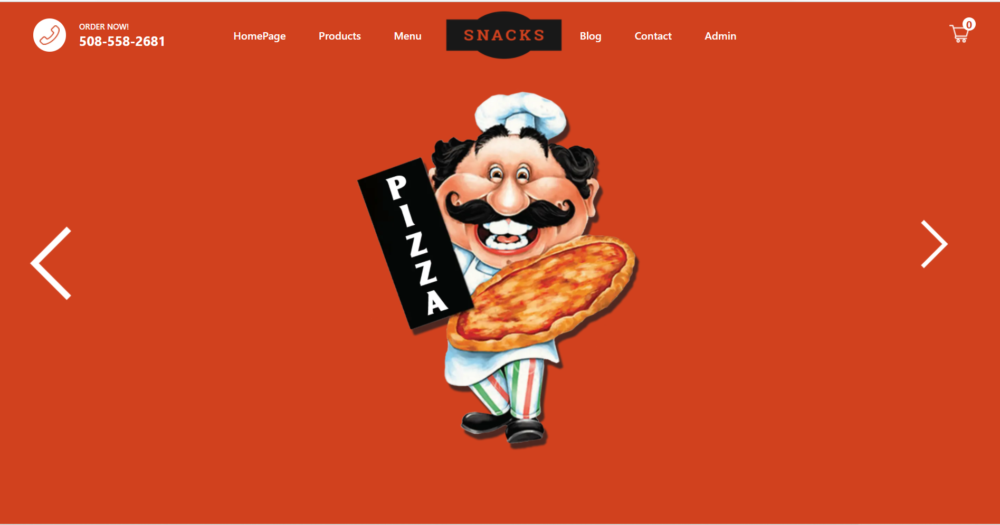
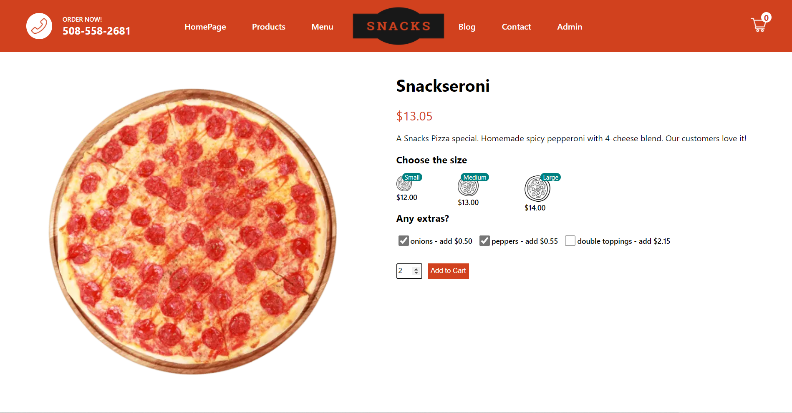
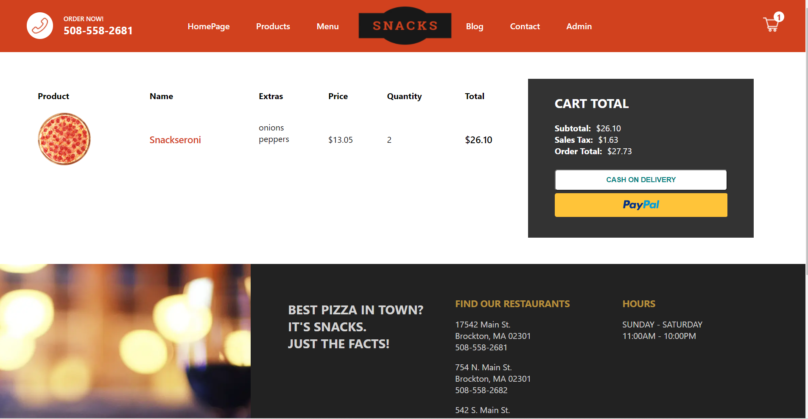
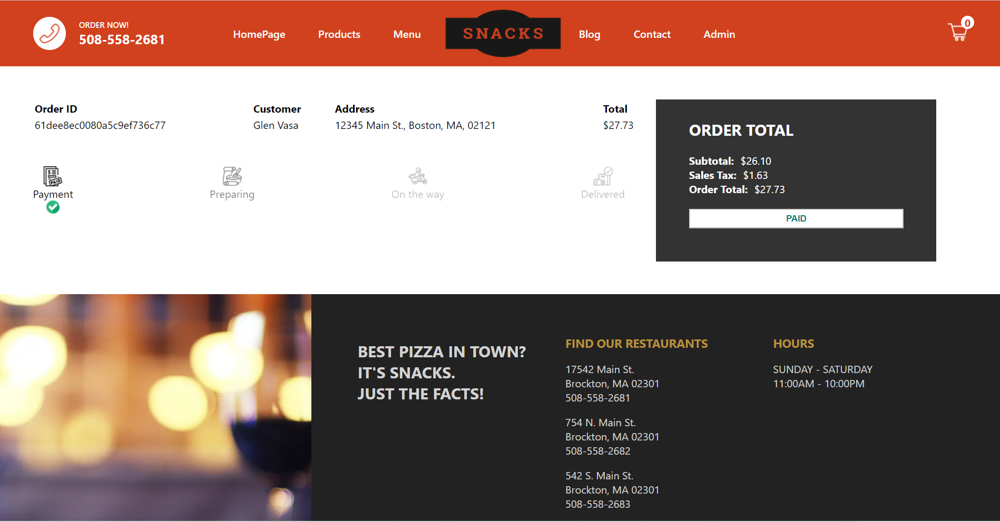
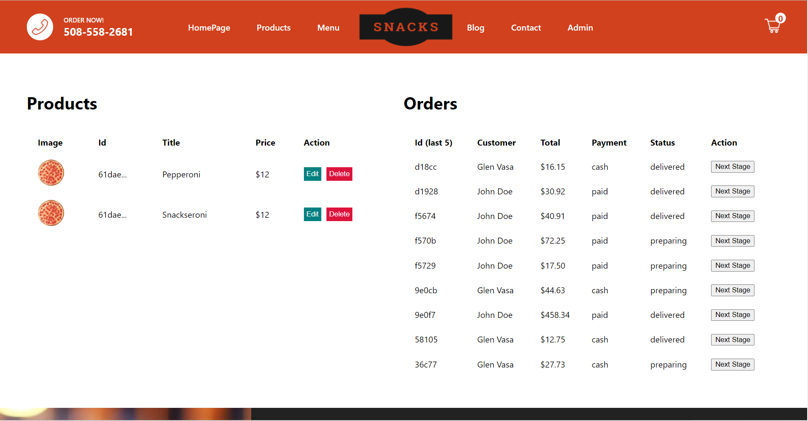

# Snacks Pizza
 
- E-Commerce restaurant/food-ordering application built with Next.js, React, Redux, and MongoDB. 
- PayPal API integrated for customer card payments. 
- Customers can order, pay, and track orders from order placement through delivery.
- Admin dashboard to add/edit products and move orders through 4 stages (payment, processing, on-the-way, delivered.)

## Screenshots
  

 
## Customized for Freelance Project
- Customized for use by nutrition/healthy living direct sales representatives.
- Reps previously had to advance customer order costs and receive payment through cash on delivery.
- Payment is now received through Paypal/credit card upon order placement.
- Customers can now place orders online instead of previously only with their rep by phone, text, or email message.
- Orders are trackable online and reps can manage featured inventory and change stage of order status on Admin dashboard.  
